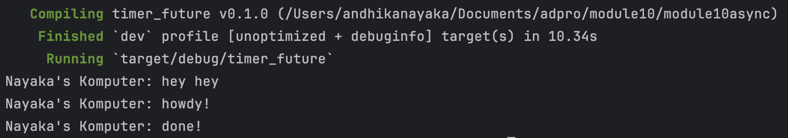
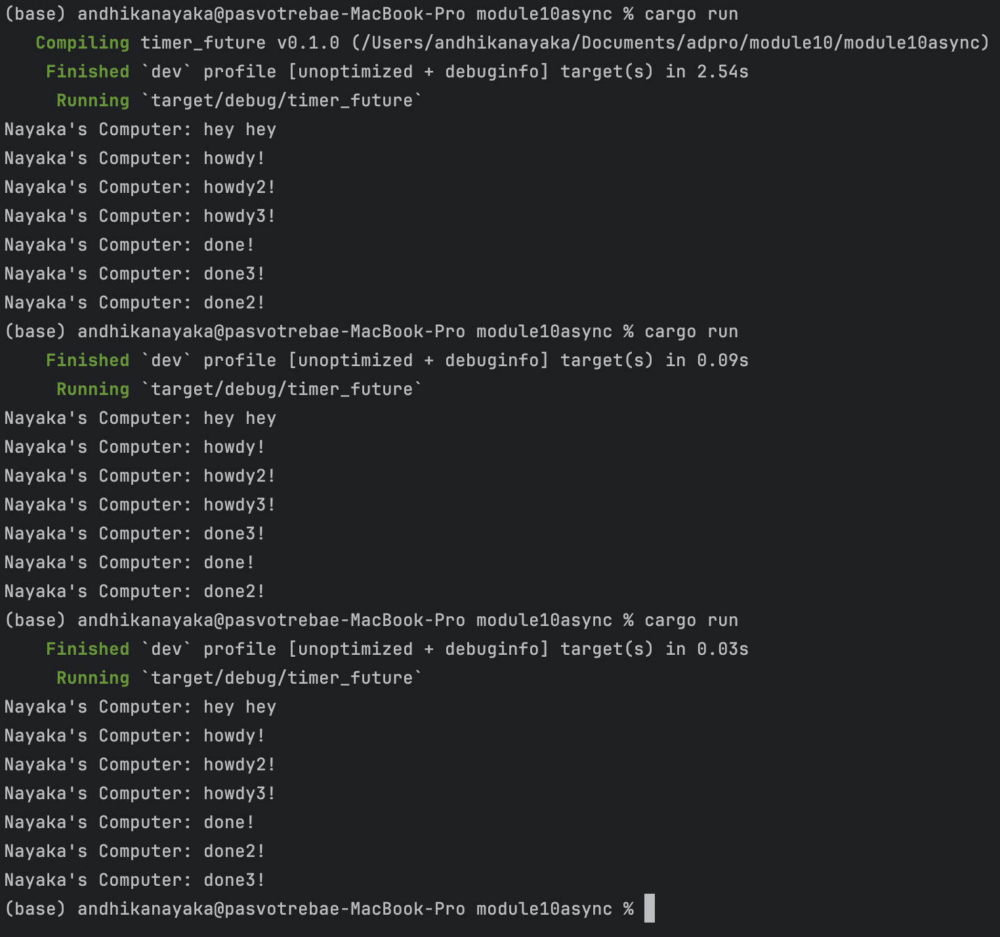
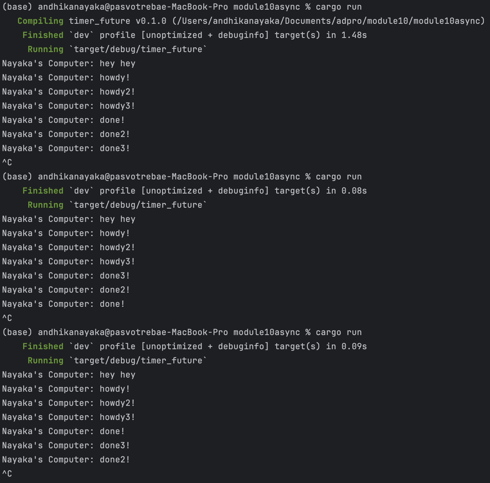

# Module 10 – Asynchronous Programming
**Andhika Nayaka Arya Wibowo · 2306174135**

---

## 1.2 · Understanding How It Works

### Screenshot



### Code Modification

In this experiment, I inserted a `println!` statement immediately after calling `spawner.spawn(...)` to help observe how asynchronous tasks are scheduled and executed. Here's a simplified version of the code snippet:

```rust
spawner.spawn(async {
    println!("async task: howdy!");
    TimerFuture::new(Duration::new(2, 0)).await;
    println!("async task: done!");
});

// Diagnostic println! to observe order
println!("Nayaka's Komputer: hey hey");
```

### What I Observed

When I ran the program, the output printed:

```
Nayaka's Komputer: hey hey
Nayaka's Komputer: howdy!
Nayaka's Komputer: done!
```

This shows that the line **after** the `spawn` call (`"hey hey"`) executed first—even though it was written after the async block in the code.

| Console Order | Output Line                        | Explanation                                                                 |
|---------------|-------------------------------------|-----------------------------------------------------------------------------|
| 1             | `Nayaka's Komputer: hey hey`       | `spawn` is non-blocking, so this line runs immediately on the main thread. |
| 2             | `Nayaka's Komputer: howdy!`        | The executor starts polling the future, and the async block begins.        |
| 3             | `Nayaka's Komputer: done!`         | After `TimerFuture` finishes sleeping, the future resumes and completes.   |

This experiment demonstrates Rust's asynchronous behavior clearly:

- **`spawn()` queues the task**, but does not execute it immediately.
- **Execution continues on the main thread**, meaning anything after `spawn()` runs without delay.
- The **executor polls the future** separately, allowing it to proceed independently.

This shows the non-blocking nature of Rust’s async model: futures are lazy and need to be driven by an executor, making them efficient for handling many I/O-bound tasks without wasting CPU.

---

## 1.3 · Multiple Spawn and Removing `drop(spawner)`

### Screenshot Comparison

**✅ With `drop(spawner);`**
- ✅ All tasks run and complete.
- ✅ Program exits cleanly.



**🚫 Without `drop(spawner);`**
- 🟡 Only some tasks finish.
- 🔴 Program does not terminate — must press `Ctrl + C` to exit manually.



---

### What I did

In this experiment, I tested what happens when we **remove** and **re-add** the line:

```rust
drop(spawner);
```

This line is important because it tells the executor that **no more tasks will be sent**. If we don’t drop the `spawner`, the executor keeps waiting forever, thinking more tasks may still be sent into the queue.

---

### Observation Summary

| Condition                   | Output Order                          | Terminates Automatically? | Explanation                                                                 |
|-----------------------------|----------------------------------------|---------------------------|-----------------------------------------------------------------------------|
| ✅ `drop(spawner)` present  | All tasks (`howdy` to `done3`) printed | ✅ Yes                    | Spawner dropped → task channel closed → executor finishes when queue is empty |
| ❌ `drop(spawner)` removed  | Some tasks printed, then hangs         | ❌ No (requires `Ctrl+C`) | Channel stays open → executor blocks on `.recv()` → never knows to stop     |

---

### Detailed Async Behavior

1. **Main-thread line runs first**
   ```rust
   println!("Nayaka's Komputer: hey hey");
   ```  
   This prints immediately because `spawner.spawn(...)` merely enqueues the future—it does **not** execute it on the spot.

2. **Spawning pushes futures onto the queue**  
   Each `spawner.spawn(async { … })` wraps your block into a `Future` and sends it into the executor’s channel. No work happens until you call `executor.run()`.

3. **Executor polls each future (the “howdy!” prints)**  
   When `executor.run()` starts, it pulls tasks off the channel and calls `poll()` on them.
    - On the first poll, each future executes its first `println!("… howdy!");` in the exact order you spawned them (1, 2, 3).

4. **TimerFuture yields and re-queues**  
   Inside each async block:
   ```rust
   TimerFuture::new(Duration::new(2, 0)).await;
   ```
   The `TimerFuture` returns `Poll::Pending`, registers its `Waker`, and the executor puts the future back into the queue.

5. **Independent timer threads wake the tasks**  
   After ~2 s, each `TimerFuture` thread calls its waker. Because the timers run on separate threads, their wake-up timings vary slightly. The executor polls the awakened futures, and each prints `println!("… done!");` in the order their timers finish.

6. **Channel closure signals shutdown**
    - **With** `drop(spawner)`: the channel’s sender half closes once all spawns are done. `ready_queue.recv()` returns `Err` after the queue empties → `executor.run()` loop ends → program exits.
    - **Without** `drop(spawner)`: the sender half stays alive, so `recv()` blocks indefinitely on an empty queue, hanging the program until you press `Ctrl + C`.